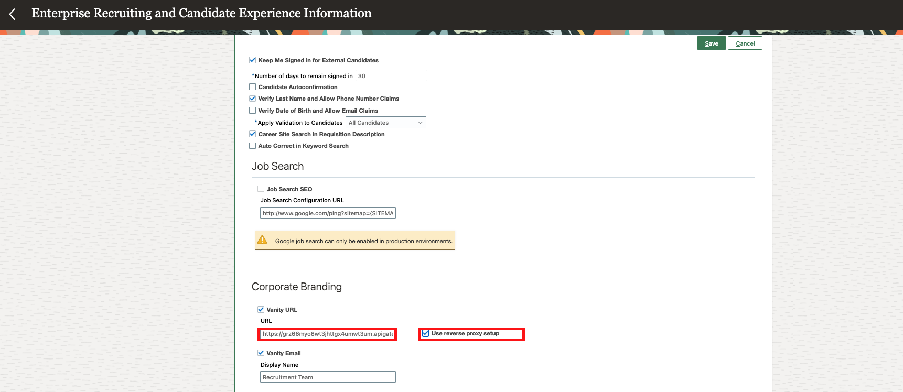

# Configure HCM instance. 

## Update

## **Introduction**

- This lab will help you enable your Vanity URL feature in your HCM instance.

Estimated Time: 10 minutes

### **Objective**

- Once the reverse proxy server and the required scripts are setup, you need to enable the Vanity URL feature in your HCM.

## **Step 1:** Enable Vanity URL 

1. Sign in to your HCM instance with your admin credentials. 

2. In the Setup and Maintenance work area, go to:   

    

    - Setup: Recruiting and Candidate Experience
    - Functional Area: Recruiting and Candidate Experience Management
    - Task: Enterprise Recruiting and Candidate Experience Information

    

2. Expand the Candidate Experience section and click Edit.

3. Select the Vanity URL option under Corporate Branding. Paste  the API Gateway URL. 

    *Note: If you have an external DNS, use your own domain name instead of API Gateway URL and make sure your DNS is pointing to the API Gateway URL in the backend.*

4. Enter the URL. Select the Use reverse proxy setup option.

    

5. Click Save.

## **Step 2:** Update CORS 

1. Go back to Setup and Maintenance work area. Click on the *Tasks icon* and *Search*. 

    

2. 
    

3. Update CORS ORIGINs.

    ```<copy>
    'self' [Enter vanity url]
    ```

    

4. Update CORS Header. 

    ```<copy>
    , ora-irc-language, ora-irc-access-code, ora-irc-validation-mode, ora-irc-vanity-domain, ora-irc-cx-userid, ora-irc-oauth-token, ora-irc-cx-timestamp, ora-irc-rest-action
    </copy>```

    


You may now *proceed to the next lab*.


## Acknowledgements
 - **Author** -  Saipriya Thirvakadu | Cloud Engineer 
 - **Contributors** - Max Grossman | Cloud Engineer, Mukul Bihari Prasad | Principal Solutions Architect
 - **Last Updated By/Date** - Saipriya Thirvakadu, Cloud Engineer, January 2021