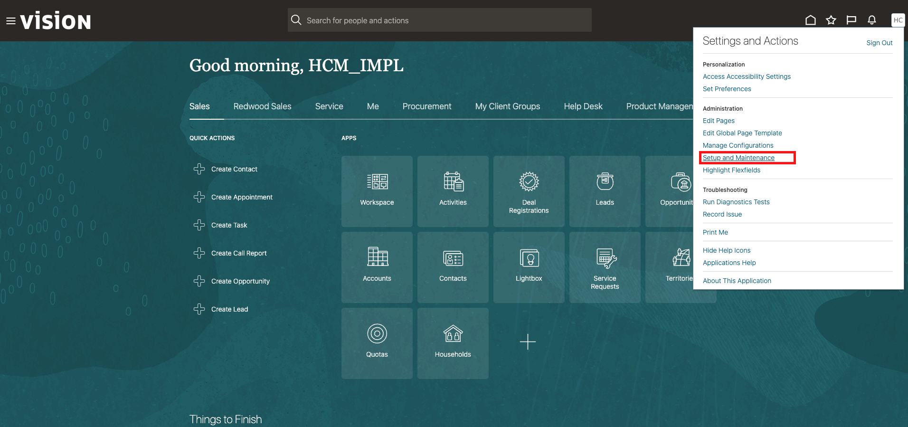
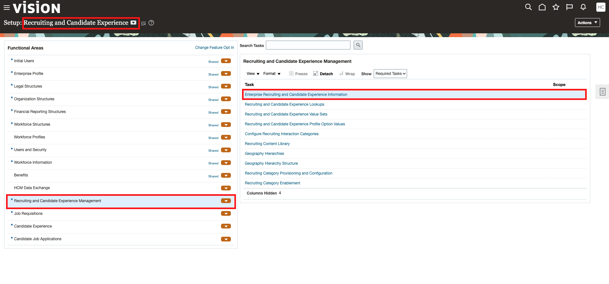
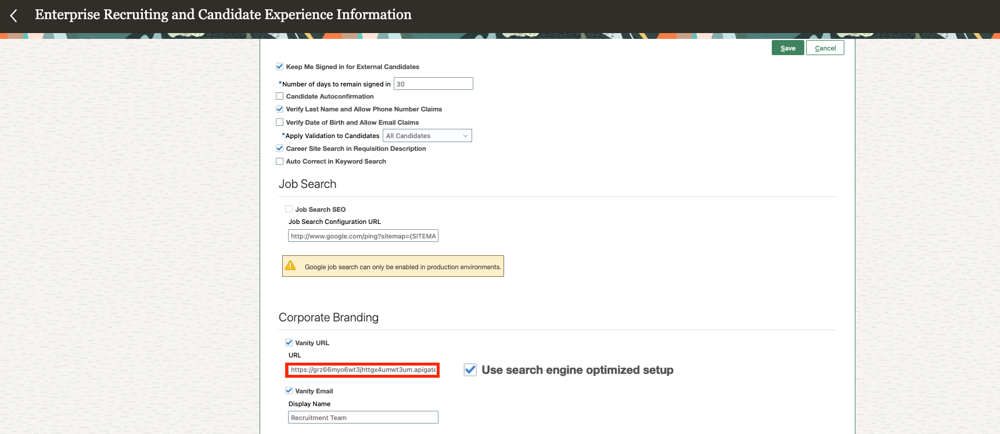
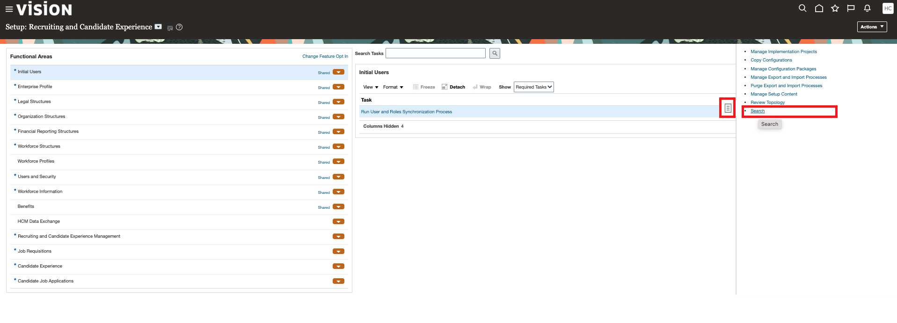
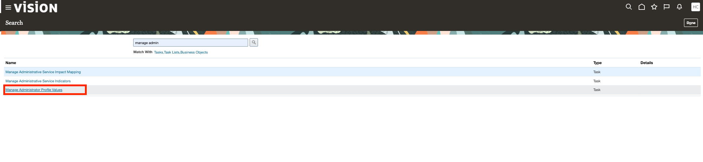
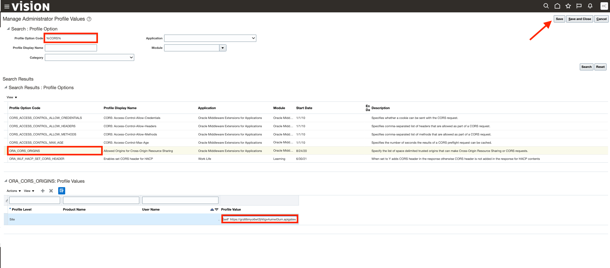
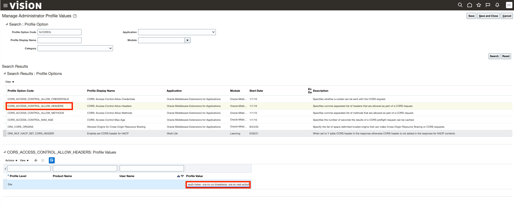

# Configure the ORC Career Site's Vanity URL

## **Introduction**

- This lab will help you enable your Vanity URL feature in your ORC instance.

Estimated Time: 10 minutes

### **Objective**

- Once the reverse proxy server and the required scripts are setup, you need to enable the Vanity URL feature in your HCM.

## **Step 1:** Enable Vanity URL 

1. Sign in to your ORC instance with your admin credentials. 

2. In the *Setup and Maintenance* work area, go to:   

    

    - *Setup*: Recruiting and Candidate Experience
    - *Functional Area*: Recruiting and Candidate Experience Management
    - *Task*: Enterprise Recruiting and Candidate Experience Information

    

2. Expand the Candidate Experience section and click Edit.

3. Select the Vanity URL option under Corporate Branding. Paste  the API Gateway URL. 

    *Note: If you have an external DNS, use your own domain name instead of API Gateway URL and make sure your DNS is pointing to the API Gateway URL in the backend.*

4. Enter the URL. Select the Use search engine optimized setup.

    

5. Click Save.

## **Step 2:** Update CORS 

1. Go back to *Setup and Maintenance* work area. Click on the *Tasks icon* and *Search*. 

    

2. Search for the task *Manage Administrator Profile Values*.

    

3. On the Manage Administrator Profile Values page, search for the profile option code %CORS%. Select ORA_CORS_ORIGINS.Go to the Profile Values section. Update the *Profile value* of the Profile level *Site* as follows:

    ```<copy>
    ##
    'self' [Enter vanity url]
    ```

    

4. Search for the profile option CORS_ACCESS_CONTROL_ALLOW_HEADERS.Go to the Profile Values section. Append these values to existing profile option value:

    ```<copy>
    , ora-irc-language, ora-irc-access-code, ora-irc-validation-mode, ora-irc-vanity-domain, ora-irc-cx-userid, ora-irc-oauth-token, ora-irc-cx-timestamp, ora-irc-rest-action
    </copy>```

    

    *Note*: Verify that you have entered the values exactly as specified. Make sure that there’s no extra blank space or missing hyphens.

5. Click Save and Close.

You may now *proceed to the next lab*.


## **Acknowledgements**

 - **Author** -  Saipriya Thirvakadu | Sr. Cloud Engineer 
 - **Contributors** - Aditya Trivedi | Sr. Cloud Engineer
 - **Last Updated By/Date** - Saipriya Thirvakadu, Sr. Cloud Engineer, June 2024