# Configuring API Gateway URL

## Introduction

- In this lab we will configure the API Gateway URL in order to trigger the function to update the header. 

Estimated Time: 60 minutes

### Objectives

- In this lab, we will add a OCI Function as an API Gateway Back End.

## **Step 1: Create a API Gateway** 

1. 
    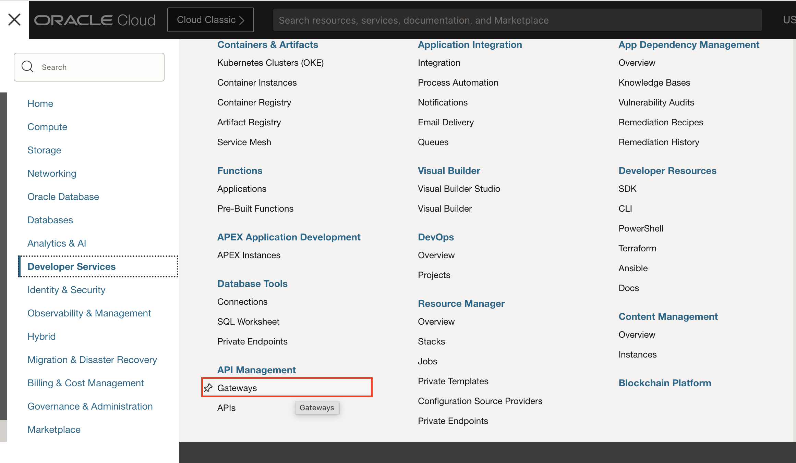

2. 

    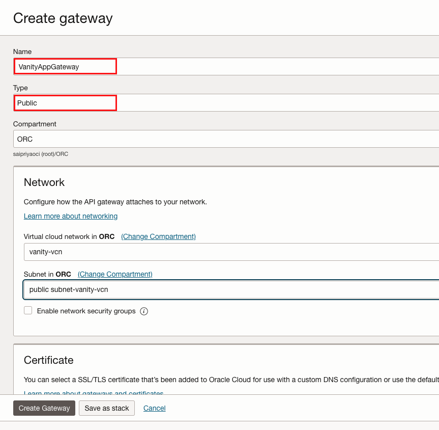

3. 
    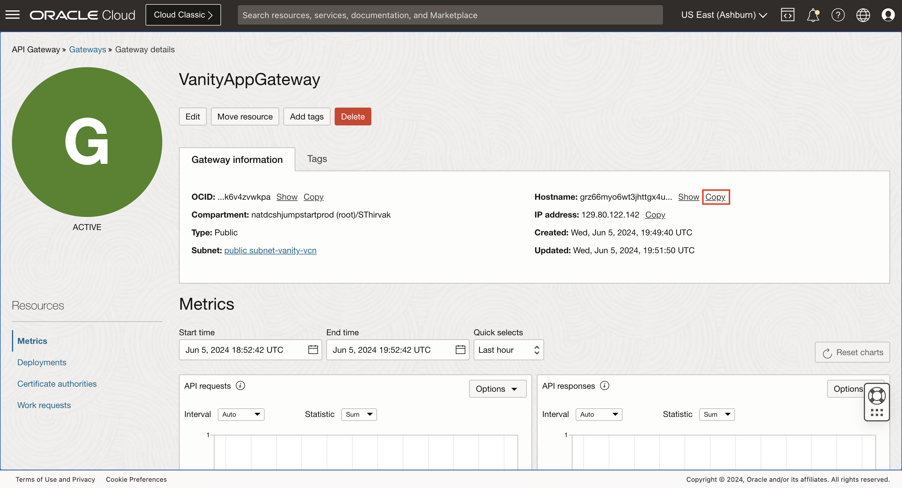

## **Step 2: Create OCI Function** 

1. 
    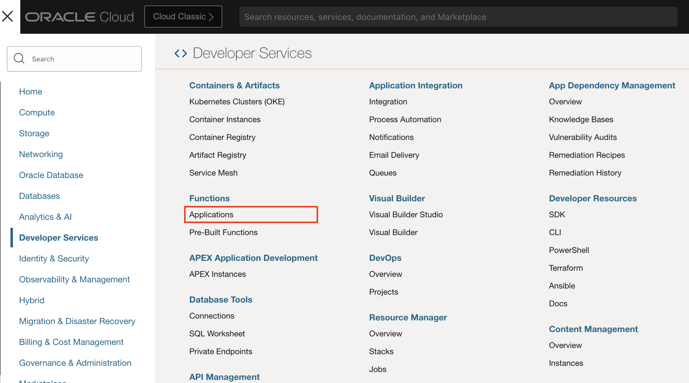

2. 

    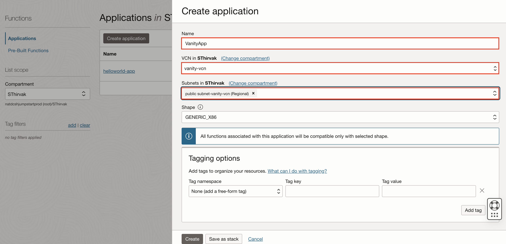

3. 
    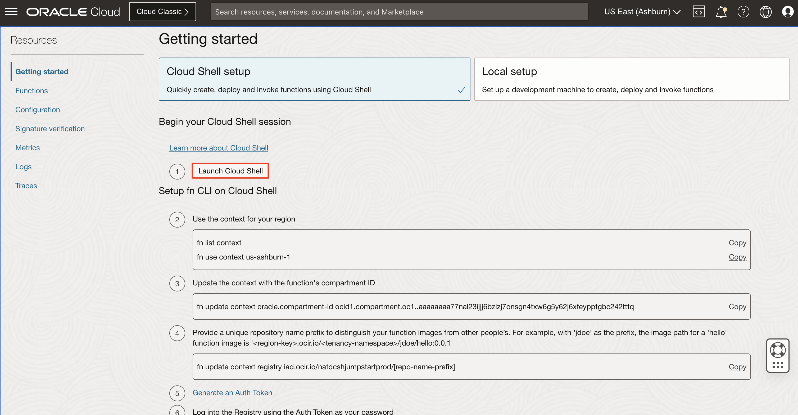

4. Run the following commands as mentioned under getting started guide:

```<copy>
##
fn list context
fn use context us-ashburn-1
fn update context oracle.compartment-id <<compartment id>>
fn update context registry iad.ocir.io/<<tenancy name>>/<<identity>>/[repo-name-prefix]
</copy>```

5. Log into the Registry using the Auth Token as your password

```<copy>
##
docker login region.ocir.io

Enter username - tenancyname/identity/useremail
Password: Generated token id (Refer Prequisite Lab)
</copy>```


6. Generate a boiler template:

```<copy>
##
fn init --runtime node vanityapp
cd vanityapp
ls
```</copy>

7. Open the vanityapp code in the OCI Code Editor


    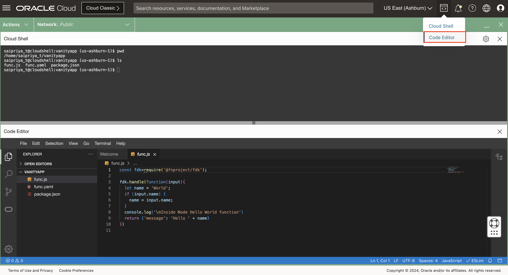

8. Replace the exisiting code inside func.js with the code below: 

```<copy>
###
const fdk=require('@fnproject/fdk');
const url = require('url');

// Call the Fn handler
fdk.handle(async function(input,ctx){
let event = ctx.httpGateway;
let queryData;
if (event  && event.requestURL) {
  var adr = event.requestURL;
  var q = url.parse(adr, true);
  
  if (adr) {
      queryData=q.query;
  }
}
// Update with your HCM base url
const baseUrl = "https://<<baseurl>>/hcmUI/CandidateExperience";
const baseVanityPath = ""; //modify if vanity url looks like https://www.vanity.com/careers. The baseVanityPath should be '/careers' in such a case
const path = q.pathname.replace(baseVanityPath, "");

//handle query parameters
const queryParameters = queryData;
let queryParameterString = "";

Object.keys(queryParameters).map((parameter) => {
  let string = parameter.toString() + "=" + encodeURIComponent(queryParameters[parameter]);
  queryParameterString += string + "&";
});

if(queryParameterString.endsWith("&")) {
  queryParameterString = queryParameterString.substring(0, queryParameterString.length - 1);
}
queryParameterString = queryParameterString ? "?" + queryParameterString : "";

const fetchUrl = baseUrl + path + queryParameterString;
var statusCode = 0;
var headers = {};

const res = await fetch(fetchUrl, {
  headers: {
    "ora-irc-vanity-domain": "Y",
  },
  redirect: "manual",
});

var bodyText = await res.text();

statusCode = res.status;
headers = {
  'Content-Type': res.headers.get('Content-Type'),
  'Location': res.headers.get('Location')?res.headers.get('Location').replace(baseUrl, "<<sample url>>"):"", //change this sample vanity URL with your vanity url
};
event.setResponseHeader("Location",headers.Location);
event.setResponseHeader("Content-Type",headers["Content-Type"]);
event.statusCode = statusCode;
return bodyText;
})
</copy>```

9. Update the baseurl with your HCM instance url and sample url with your API Gateway URL we copied in *Step 1*. 

    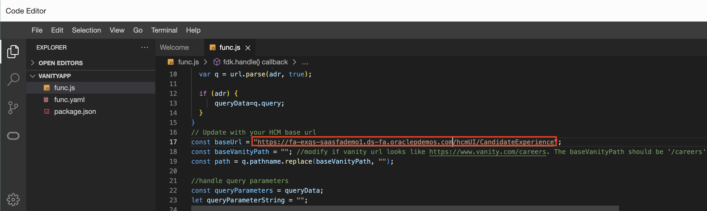
    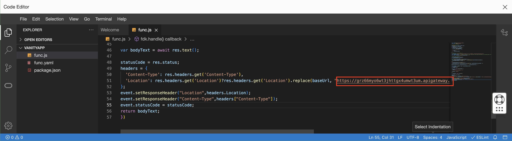

10. Deploy your Functions app. 

   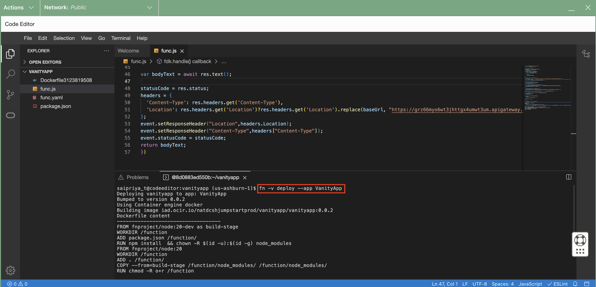

## **Step 3: Create a deployment in the API Gateway** 

1. Switch to the API Gateway section. Create a deployment. 

   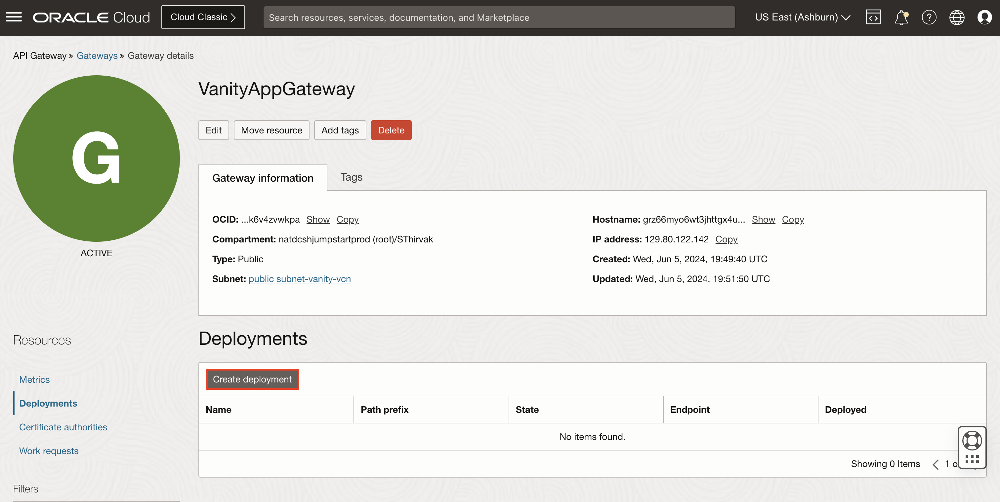
2. 
    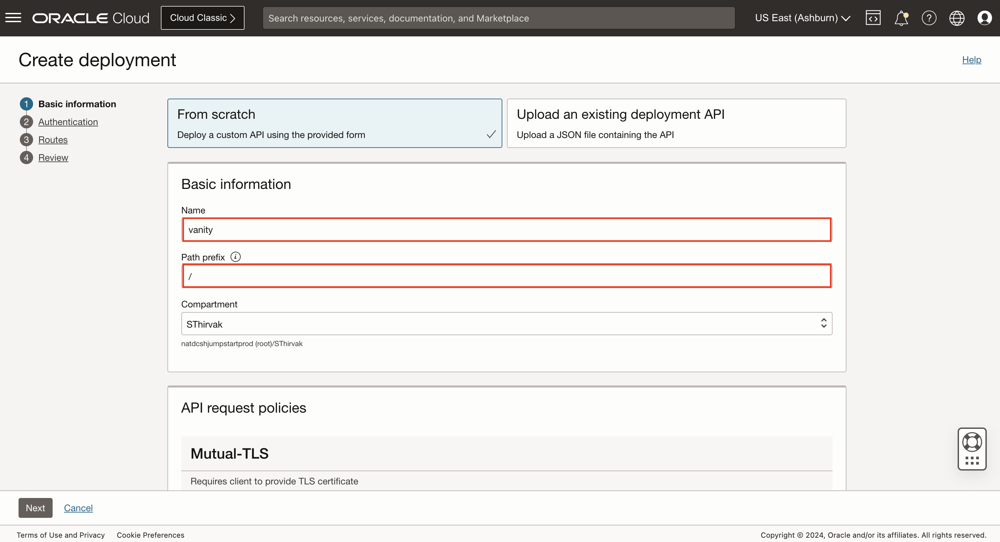

3. 
    

4. Switch to the routes tab. 

    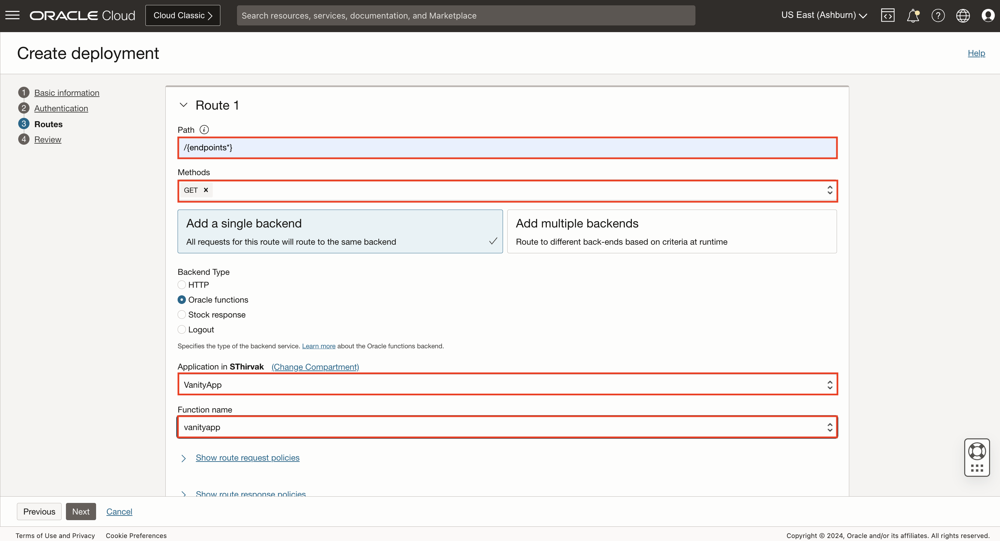

5. 
    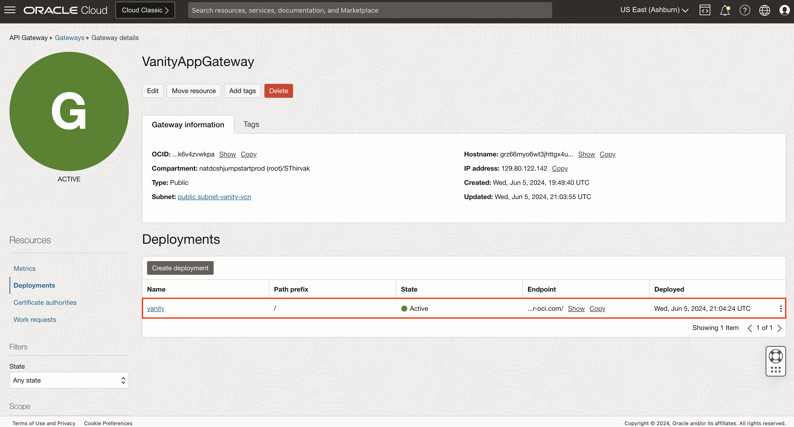

## **Acknowledgements**

 - **Author** -  Saipriya Thirvakadu | Sr. Cloud Engineer 
 - **Contributors** - Aditya Trivedi | Sr. Cloud Engineer
 - **Last Updated By/Date** - Saipriya Thirvakadu, Sr. Cloud Engineer, June 2024