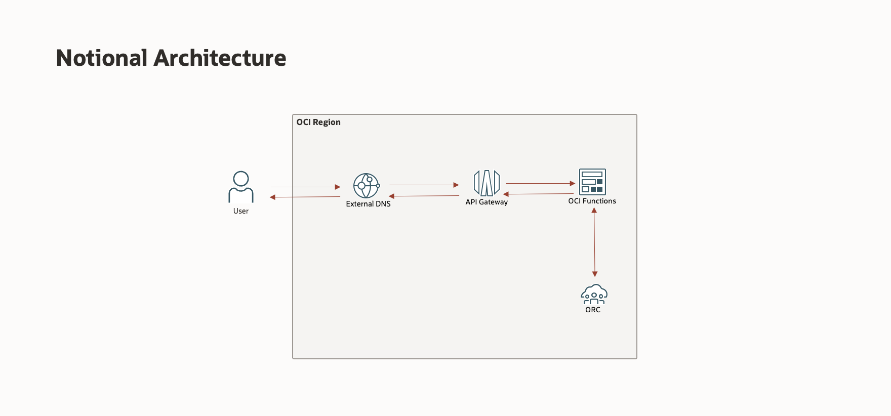

# Prerequisites

## **Introduction**

Customers seeking to host their Oracle Recruiting Cloud (ORC) Career Site at a custom vanity/branded domain can leverage Oracle Cloud Infrastructure (OCI) services :

- Create and Deploy an OCI API Gateway that triggers an OCI Function to fetch the Career Site from Cloud HCM Recruiting and relay it back.

- Add a DNS record using the OCI External DNS service to link the custom/branded vanity URL with the deployed OCI API Gateway service URL. 

Refer to the architecture diagram below for more details: 

In this tutorial, you will learn how to setup Vanity URL leveraging Oracle Cloud Services.

Minimum Requirements: 

Estimated Time: 30 min

## **Configure Virtual Cloud Network**

A virtual cloud network (VCN) is a virtual, private network that closely resembles a traditional network, with firewall rules and specific types of communication gateways that you can choose. You can designate a subnet to exist either in a single availability domain or across an entire region (regional subnets are recommended). 

In this lab, we will configure a Virtual Cloud Network for both API Gateway and OCI Functions. 

1. Click on the navigation on the top left and select virtual cloud network under Networking.

2. Select *Start VCN Wizard > Create VCN with Internet Connectivity*.
3. Enter *VCN name* and select the *compartment name*. Leave everything to default settings. 

4. Review and create a VCN. 

5. Select your public subnet and click *Default security list*. Now add the *ingress rules* as follows: 

*PORT 80 - HTTP, PORT 443 - HTTPS*

## **Generate Auth Token**

To create a new auth token:

1. In the top-right corner of the Console, open the *Profile* menu and then click *User Settings* to view the details.
2. On the Auth Tokens page, click *Generate Token*.
3. Enter a friendly description for the auth token. Avoid entering confidential information.
4. Click *Generate Token*. The new auth token is displayed.
5. Copy the auth token immediately to a secure location from where you can retrieve it later, because you won't see the auth token again in the Console.
6. Close the Generate Token dialog.

## **Summary**

This completes the pre-requisites. 

You may now *proceed to the next lab*.

## **Acknowledgements**

 - **Author** -  Saipriya Thirvakadu | Sr. Cloud Engineer 
 - **Contributors** - Aditya Trivedi | Sr. Cloud Engineer
 - **Last Updated By/Date** - Saipriya Thirvakadu, Sr. Cloud Engineer, June 2024

## See an issue?
Please submit feedback to codeinnovate\_us\_grp@oracle.com. 