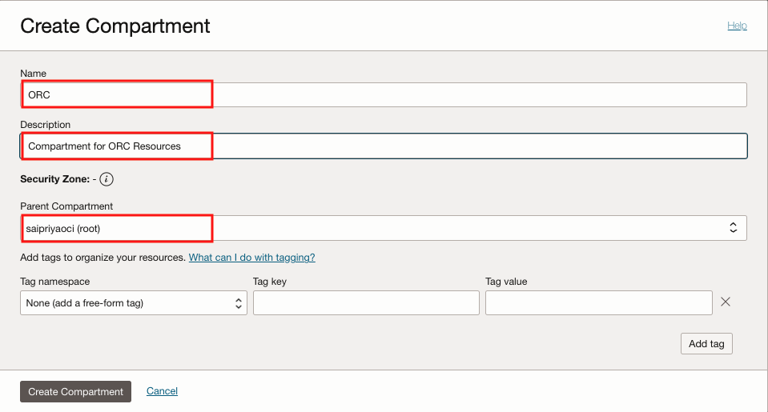

# Prerequisites

## **Introduction**

Customers seeking to host their Oracle Recruiting Cloud (ORC) Career Site at a custom vanity/branded domain can leverage Oracle Cloud Infrastructure (OCI) services :

- Create and Deploy an OCI API Gateway that triggers an OCI Function to fetch the Career Site from Cloud HCM Recruiting and relay it back.

- Add a DNS record using the OCI External DNS service to link the custom/branded vanity URL with the deployed OCI API Gateway service URL. 

Refer to the architecture diagram below for more details: 


In this tutorial, you will learn how to setup Vanity URL leveraging Oracle Cloud Services.

Minimum Requirements: 

Estimated Time: 30 min

## **Create a Compartment**

1. Open the navigation menu and click Identity & Security. Under Identity, click Compartments.
2. Navigate to the compartment in which you want to create the compartment.
    - To create the compartment in the tenancy (root compartment) click Create Compartment. 
    - Otherwise, click through the hierarchy of compartments until you reach the detail page of the compartment in which you want to create the compartment. Then, on the details page, click Create Compartment.
3. Enter the following information:
    - Name: A unique name for the compartment with a maximum of 100 characters, including letters, numbers, periods, hyphens, and underscores). The name must be unique across all the compartments in the tenancy. Avoid entering confidential information.
    - Description: A friendly description. You can change this later.
    - Parent Compartment: The compartment that you're in is displayed. To choose another compartment to create this compartment in, select it from the list.
    - Tags: If you have permissions to create a resource, then you also have permissions to apply free-form tags to that resource. To apply a defined tag, you must have permissions to use the tag namespace. For more information about tagging, see Resource Tags. If you're not sure whether to apply tags, skip this option or ask an administrator. You can apply tags later. You can apply tags later.
    

4. Click Create Compartment.

## **Create Policies**

1. Open the navigation menu and click Identity & Security. Under Identity, click Policies.
2. Click Create Policy.
    - Enter the following information:
    - Name: A unique name for the policy. The name must be unique across all policies in the tenancy. You can't change this later. Avoid entering confidential information.
    - Description: A friendly description. You can change this later.
    - Compartment: If you want to attach the policy to a compartment other than the one you're viewing, select it from list. Where the policy is attached controls who can later modify or delete it (see Policy Attachment).
    - Enter the policy statements using the policy builder. Use the basic option if you want to choose from common policy templates, which you can also customize. Select Show manual editor if you already know how to write the statements you need and you want to enter them in a text box.

    ```<copy>
    ##
    
    ```

3. Click Create.

## **Configure Virtual Cloud Network**

A virtual cloud network (VCN) is a virtual, private network that closely resembles a traditional network, with firewall rules and specific types of communication gateways that you can choose. You can designate a subnet to exist either in a single availability domain or across an entire region (regional subnets are recommended). 

In this lab, we will configure a Virtual Cloud Network for both API Gateway and OCI Functions. 

1. Click on the navigation on the top left and select virtual cloud network under Networking.


2. Select *Start VCN Wizard > Create VCN with Internet Connectivity*.
3. Enter *VCN name* and select the *compartment name*. Leave everything to default settings. 


4. Review and create a VCN. 


5. Select your public subnet and click *Default security list*. Now add the *ingress rules* as follows: 


*PORT 80 - HTTP, PORT 443 - HTTPS*

## **Generate Auth Token**

To create a new auth token:

1. In the top-right corner of the Console, open the *Profile* menu and then click *User Settings* to view the details.
2. On the Auth Tokens page, click *Generate Token*.
3. Enter a friendly description for the auth token. Avoid entering confidential information.
4. Click *Generate Token*. The new auth token is displayed.
5. Copy the auth token immediately to a secure location from where you can retrieve it later, because you won't see the auth token again in the Console.
6. Close the Generate Token dialog.

## **Summary**

This completes the pre-requisites. 

You may now *proceed to the next lab*.

## **Acknowledgements**

 - **Author** -  Saipriya Thirvakadu | Sr. Cloud Engineer 
 - **Contributors** - Aditya Trivedi | Sr. Cloud Engineer
 - **Last Updated By/Date** - Saipriya Thirvakadu, Sr. Cloud Engineer, June 2024

## See an issue?
Please submit feedback to codeinnovate\_us\_grp@oracle.com. 