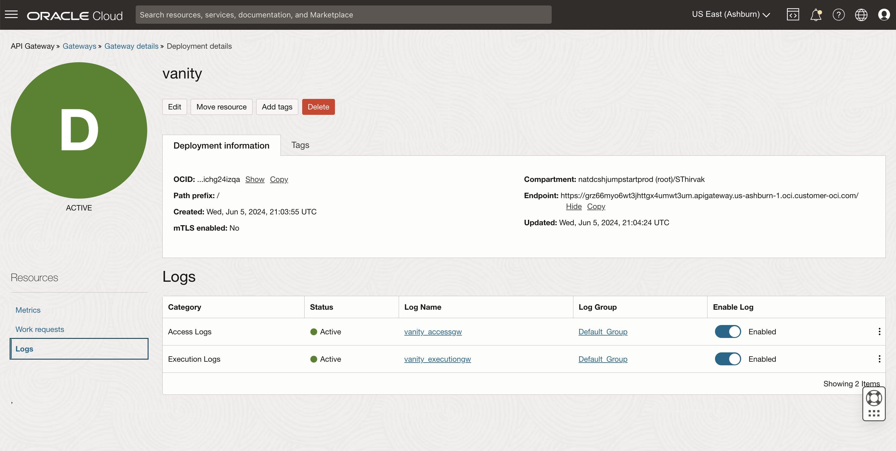
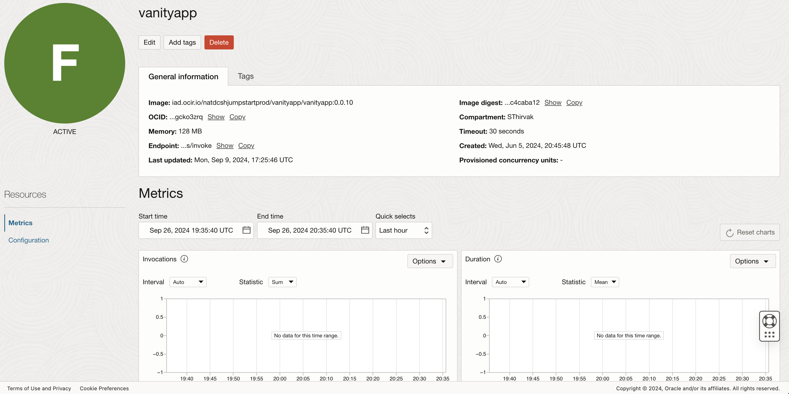

# Troubleshooting Steps for OCI Functions and OCI API Gateway

## **Introduction**

This guide will help you troubleshoot issues with OCI Functions and OCI API Gateway, providing possible solutions to common problems.

Minimum Requirements: Ensure you have access to the OCI Console and have the necessary permissions.

Estimated Time: 5 minutes

## **Issue: OCI API Gateway Doesn't Invoke OCI Functions**

Steps to Troubleshoot:

*Check API Gateway Logs*:

1. Go to the *API Gateway Console*.

2. Select the deployment you created.

3. Switch to the Logs section under Resources.

4. Enable both Access Logs and Execution Logs.

 


*Check OCI Function Logs*:

1. Perform similar steps for the *OCI Function* you created in *Lab 2*.

2. Ensure logging is enabled for the function.

*Test the API Gateway URL*:

1. Call the API Gateway's URL from a browser or API client.

2. Verify if the OCI Function endpoint is triggered.

*Verify Logs and Metrics*:

If the OCI Function is not triggered, you will notice no logs are collected, and the metrics dashboard doesn't display any data.

 

*Solution: Update Policies*

If you see this error, update the dynamic group policy by adding the following rule:

```<copy>
Allow dynamic-group '[Domain]'/'[Dynamic Group]' to use all-resources in compartment [compartment name]
```

## **Summary**

This guide covers the basic troubleshooting steps for OCI Functions and API Gateway. If you encounter further issues, consider revisiting the logs and ensuring that the necessary IAM policies are correctly set up.

For further guidance, review the following documents:

Troubleshooting OCI Functions: https://docs.oracle.com/en-us/iaas/Content/Functions/Tasks/functionstroubleshooting.htm

Troubleshooting API Gateway: https://docs.oracle.com/en-us/iaas/Content/APIGateway/Tasks/apigatewaytroubleshooting.htm

## **Acknowledgements**

 - **Author** -  Saipriya Thirvakadu | Sr. Cloud Engineer 
 - **Contributors** - Aditya Trivedi | Sr. Cloud Engineer
 - **Last Updated By/Date** - Saipriya Thirvakadu, Sr. Cloud Engineer, Sept 2024

## See an issue?
Please submit feedback to codeinnovate\_us\_grp@oracle.com. 