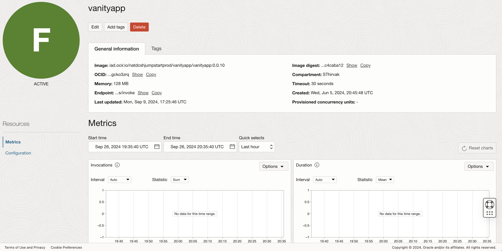

# Troubleshooting steps

## **Introduction**

Find out how to troubleshoot problems with OCI Functions and OCI API Gateway, and possible solutions to common issues.

Minimum Requirements: 

Estimated Time: 5 mins


## ** OCI API Gateway doesn't invoke OCI Functions**

1. Go back to *API Gateway console*, select the deployment you created and switch to *logs* section under Resources. 

2. Enable Access logs and Execution logs.  

 

3. Perform the above steps for OCI Function as well. 

4. When an API Gateway's URL is called from a browser, do check if the OCI Function endpoint is being triggered or not.

5. If the OCI Function is not triggered, you will notice that there are no logs collected and metrics doesn't show any data. 

 


**If you see this error:**

Go ahead and add the following policy in the Dynamic group you created. 

```<copy>
Allow dynamic-group '<Domain>'/'<Dynamic Group>' to use all-resources in compartment <compartment name>
```

## **Summary**

Review troubleshooting steps for Functions and API Gateway if your encounter more errors. 

## **Acknowledgements**

 - **Author** -  Saipriya Thirvakadu | Sr. Cloud Engineer 
 - **Contributors** - Aditya Trivedi | Sr. Cloud Engineer
 - **Last Updated By/Date** - Saipriya Thirvakadu, Sr. Cloud Engineer, Sept 2024

## See an issue?
Please submit feedback to codeinnovate\_us\_grp@oracle.com. 